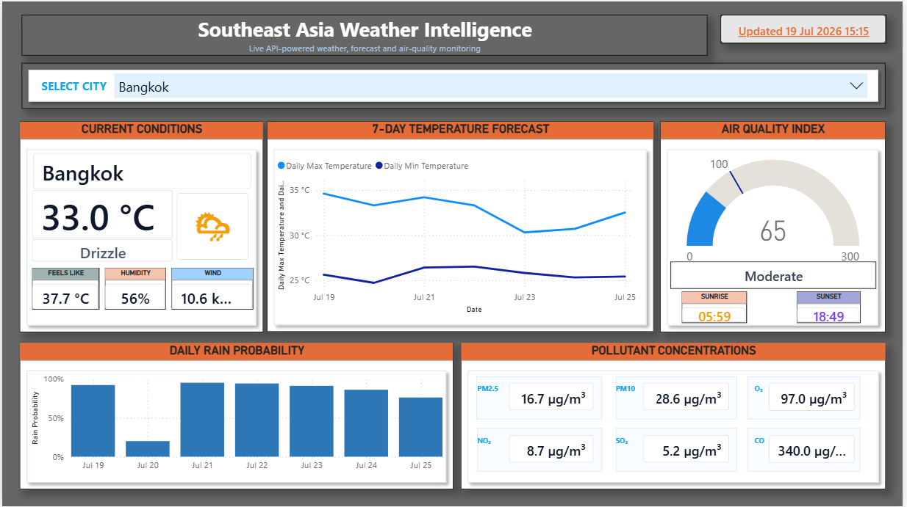
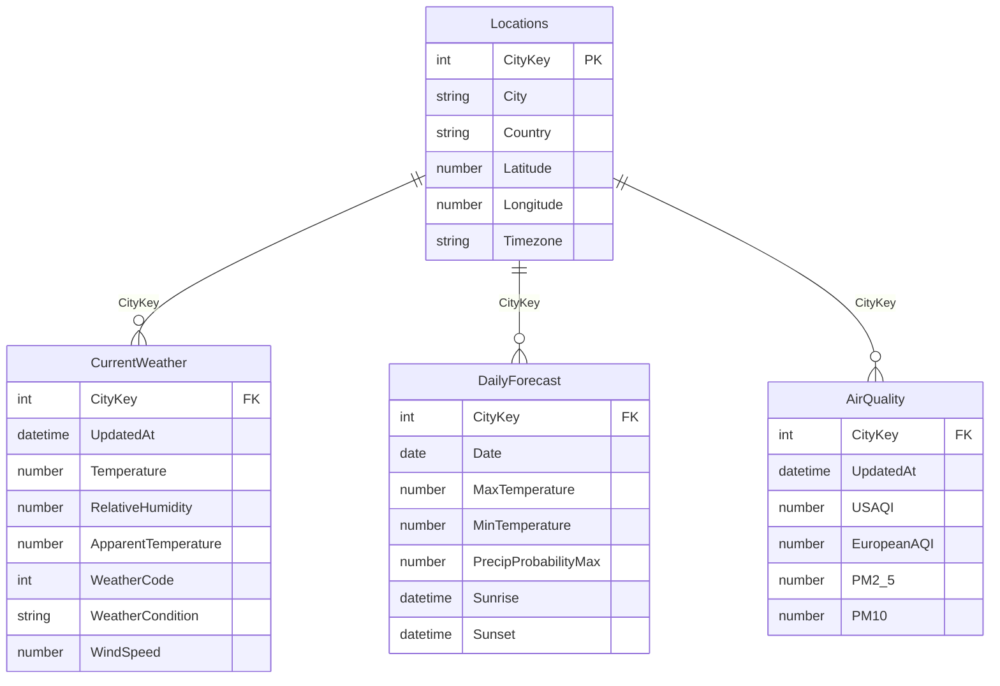

# Southeast Asia Weather Intelligence Dashboard



An interactive Power BI portfolio project that combines current weather, a seven-day forecast, rainfall probability, sunrise and sunset, air-quality indices, and pollutant concentrations for six major Southeast Asian cities.

## Download the Power BI report

**[Download `SEAWeatherIntelligence.pbix`](powerbi/SEAWeatherIntelligence.pbix?raw=1)**

The PBIX file contains the report, semantic model, Power Query transformations, DAX measures, and the data cached during the last successful refresh.

### Refresh the report for the latest information

1. Download and open `SEAWeatherIntelligence.pbix` in Microsoft Power BI Desktop.
2. Select **Home → Refresh**.
3. If Power BI requests credentials, choose **Anonymous** authentication and set the privacy level to **Public** for both Open-Meteo domains.
4. Wait until `CurrentWeather`, `DailyForecast`, and `AirQuality` finish loading.
5. Save the PBIX after the refresh if you want to retain the latest imported data.

GitHub displays the screenshot and source files, but it cannot run a PBIX report interactively in the browser. To use the city selector and other interactions, open the PBIX in Power BI Desktop or publish it to a permitted Power BI workspace.

## Project objectives

- Demonstrate end-to-end API integration in Power BI.
- Transform nested JSON responses with Power Query.
- Build a clean dimensional model that supports one city slicer across all visuals.
- Create reusable DAX measures for weather, forecast, astronomy, AQI, and pollutants.
- Present technical data in a concise, portfolio-ready dashboard.

## Dashboard coverage

The dashboard currently supports:

- Bangkok, Thailand
- Jakarta, Indonesia
- Singapore, Singapore
- Kuala Lumpur, Malaysia
- Manila, Philippines
- Ho Chi Minh City, Vietnam

## Dashboard sections

| Section | Purpose |
|---|---|
| City selector | Filters the complete dashboard to one city. |
| Current conditions | Displays city, temperature, apparent temperature, humidity, wind speed, weather condition, and icon. |
| Seven-day temperature forecast | Compares daily maximum and minimum temperatures. |
| Air Quality Index | Displays US AQI, a target reference, category, sunrise, and sunset. |
| Daily rain probability | Shows the maximum forecast precipitation probability for each day. |
| Pollutant concentrations | Displays PM2.5, PM10, ozone, nitrogen dioxide, sulphur dioxide, and carbon monoxide. |
| Updated timestamp | Shows the latest current-weather timestamp returned by the API after refresh. |

## APIs used

This project uses two public JSON endpoints from [Open-Meteo](https://open-meteo.com/):

1. **Weather Forecast API** — `https://api.open-meteo.com/v1/forecast`
2. **Air Quality API** — `https://air-quality-api.open-meteo.com/v1/air-quality`

No API key is stored in this project. Power Query sends one multi-coordinate request to each endpoint, so all six cities are retrieved efficiently in two web requests per refresh.

### Weather variables

Current weather:

- `temperature_2m`
- `relative_humidity_2m`
- `apparent_temperature`
- `is_day`
- `precipitation`
- `weather_code`
- `surface_pressure`
- `wind_speed_10m`
- `visibility`

Daily forecast:

- `weather_code`
- `temperature_2m_max`
- `temperature_2m_min`
- `precipitation_probability_max`
- `precipitation_sum`
- `sunrise`
- `sunset`
- `wind_speed_10m_max`

Air quality:

- `us_aqi`
- `european_aqi`
- `pm10`
- `pm2_5`
- `carbon_monoxide`
- `nitrogen_dioxide`
- `sulphur_dioxide`
- `ozone`

A detailed explanation of the API requests and Power Query workflow is available in [docs/API_INTEGRATION.md](docs/API_INTEGRATION.md) and [docs/POWER_QUERY.md](docs/POWER_QUERY.md).

## Data model

The model contains one location dimension, three imported analytical tables, and a dedicated measure table:



See [docs/DATA_MODEL.md](docs/DATA_MODEL.md) and [docs/DATA_DICTIONARY.md](docs/DATA_DICTIONARY.md) for the full model and field definitions.

## DAX measures

The report contains 30 documented measures grouped into:

- Context
- Current Weather
- Astronomy
- Air Quality
- Pollutants
- Forecast

The complete formula and explanation for every measure are available in [docs/DAX_MEASURES.md](docs/DAX_MEASURES.md).

The `AQI Category Color` measure uses a custom portfolio palette:

| US AQI | Category | Custom color |
|---:|---|---|
| 0–50 | Good | Green `#00B050` |
| 51–100 | Moderate | Blue `#1E88E5` |
| 101–150 | Unhealthy for sensitive groups | Light red `#FF7B7B` |
| 151–200 | Unhealthy | Maroon `#800000` |
| 201–300 | Very unhealthy | Bright red `#FF0000` |
| Above 300 | Hazardous | Dark red `#9B0000` |

These are custom dashboard colors; the category thresholds follow the US AQI scale.

## Repository structure

```text
.
├── README.md
├── LICENSE
├── NOTICE.md
├── CHANGELOG.md
├── CITATION.cff
├── assets/
│   └── dashboard-preview.png
├── powerbi/
│   └── SEAWeatherIntelligence.pbix
├── src/
│   ├── SEAWeatherIntelligence.pbip
│   ├── SEAWeatherIntelligence.Report/
│   └── SEAWeatherIntelligence.SemanticModel/
└── docs/
    ├── API_INTEGRATION.md
    ├── POWER_QUERY.md
    ├── DATA_MODEL.md
    ├── DATA_DICTIONARY.md
    ├── DAX_MEASURES.md
    ├── DASHBOARD_GUIDE.md
    ├── REFRESH_GUIDE.md
    ├── TROUBLESHOOTING.md
    └── GITHUB_UPLOAD_GUIDE.md
```

## Technical stack

- Microsoft Power BI Desktop
- Power Query M
- DAX
- Open-Meteo Forecast API
- Open-Meteo Air Quality API
- JSON over HTTPS
- Power BI Project format (`.pbip`) and TMDL source files

## Important usage notes

- The model uses Import mode. Values change only after the report or semantic model is refreshed.
- The free Open-Meteo endpoint is intended for non-commercial use under its current terms. Review the latest Open-Meteo terms before commercial deployment.
- Open-Meteo API data require attribution under CC BY 4.0.
- Weather and air-quality values are model-based information and should not be treated as emergency, medical, or regulatory advice.

## Documentation

- [API integration](docs/API_INTEGRATION.md)
- [Power Query transformations](docs/POWER_QUERY.md)
- [Data model](docs/DATA_MODEL.md)
- [Data dictionary](docs/DATA_DICTIONARY.md)
- [DAX measures](docs/DAX_MEASURES.md)
- [Dashboard guide](docs/DASHBOARD_GUIDE.md)
- [Refresh guide](docs/REFRESH_GUIDE.md)
- [Troubleshooting](docs/TROUBLESHOOTING.md)
- [GitHub upload guide](docs/GITHUB_UPLOAD_GUIDE.md)

## Attribution

Weather and air-quality data are provided by [Open-Meteo.com](https://open-meteo.com/) under the [Creative Commons Attribution 4.0 International licence](https://creativecommons.org/licenses/by/4.0/). The data are transformed and visualized in Power BI for this project.

## Author

**Herison Surbakti**  
Power BI, data analytics, business intelligence, and applied data research portfolio project.
