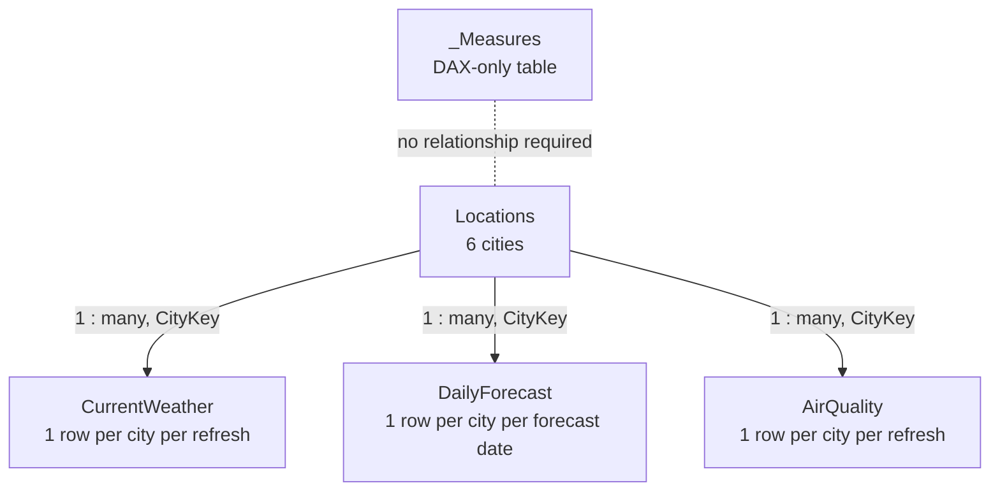

# Data Model

## Modeling approach

The report uses a small dimensional model. `Locations` is the shared dimension, while the three API result tables contain current weather, daily forecasts, and current air-quality data.

## Tables

### `Locations`

**Role:** Dimension table and slicer source.  
**Primary key:** `CityKey`.  
**Expected rows:** 6.

The fixed coordinates ensure the API retrieves the intended locations without relying on ambiguous text-based geocoding.

### `CurrentWeather`

**Role:** Current-condition snapshot.  
**Foreign key:** `CityKey`.  
**Grain:** One row per city for the most recent imported API response.

### `DailyForecast`

**Role:** Seven-day daily forecast.  
**Foreign key:** `CityKey`.  
**Grain:** One row per city per forecast date.

This table supplies the temperature line chart, rain-probability column chart, sunrise, sunset, and optional rainfall measures.

### `AirQuality`

**Role:** Current AQI and pollutant snapshot.  
**Foreign key:** `CityKey`.  
**Grain:** One row per city for the most recent imported API response.

### `_Measures`

**Role:** Central DAX measure container.  
**Physical content:** One hidden dummy row used only to host measures.  
**Relationships:** None required.

## Relationships

| From | To | Cardinality | Filter direction | Purpose |
|---|---|---|---|---|
| `Locations[CityKey]` | `CurrentWeather[CityKey]` | One-to-many | Single | Filters current conditions by selected city. |
| `Locations[CityKey]` | `DailyForecast[CityKey]` | One-to-many | Single | Filters daily forecast and astronomy by selected city. |
| `Locations[CityKey]` | `AirQuality[CityKey]` | One-to-many | Single | Filters AQI and pollutants by selected city. |

## Interaction logic

The city slicer uses `Locations[City]`. Because `Locations` filters all three imported tables through `CityKey`, one selection updates:

- Current condition cards.
- Weather icon and condition label.
- Seven-day temperature chart.
- Rain-probability chart.
- AQI gauge and category.
- Sunrise and sunset.
- Pollutant cards.

## Why there is no separate Date dimension

The dashboard currently covers only a short seven-day forecast and does not implement year-over-year, month-over-month, or long-horizon time intelligence. The forecast date itself is therefore sufficient for the current visual requirements.

A dedicated Date dimension should be added if the model is extended with historical weather, seasonal analysis, or long-term trend comparisons.

## Import mode

All API responses are imported into the PBIX semantic model. Benefits include fast interaction and simple cross-filtering. The trade-off is that data remain unchanged until a manual or scheduled refresh occurs.
