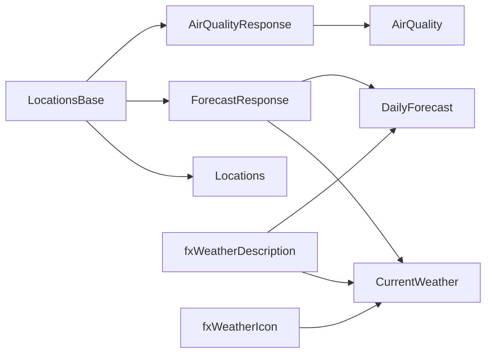

# Power Query and Data Transformation

## Query dependency flow



## 1. Static location expression

`LocationsBase` is an in-model table containing stable identifiers, coordinates, countries, and IANA timezone names.

```powerquery
#table(
    type table [CityKey=Int64.Type, City=text, Country=text, Latitude=number, Longitude=number, Timezone=text],
    {
        {1, "Bangkok", "Thailand", 13.7563, 100.5018, "Asia/Bangkok"},
        {2, "Jakarta", "Indonesia", -6.2088, 106.8456, "Asia/Jakarta"},
        {3, "Singapore", "Singapore", 1.3521, 103.8198, "Asia/Singapore"},
        {4, "Kuala Lumpur", "Malaysia", 3.1390, 101.6869, "Asia/Kuala_Lumpur"},
        {5, "Manila", "Philippines", 14.5995, 120.9842, "Asia/Manila"},
        {6, "Ho Chi Minh City", "Vietnam", 10.8231, 106.6297, "Asia/Ho_Chi_Minh"}
    }
)
```

## 2. Weather-code description function

The API returns WMO weather interpretation codes. `fxWeatherDescription` converts them into readable labels.

```powerquery
(code as nullable number) as text =>
    if code = null then "Unknown"
    else if code = 0 then "Clear sky"
    else if code = 1 then "Mainly clear"
    else if code = 2 then "Partly cloudy"
    else if code = 3 then "Overcast"
    else if List.Contains({45,48}, code) then "Fog"
    else if List.Contains({51,53,55}, code) then "Drizzle"
    else if List.Contains({56,57}, code) then "Freezing drizzle"
    else if List.Contains({61,63,65}, code) then "Rain"
    else if List.Contains({66,67}, code) then "Freezing rain"
    else if List.Contains({71,73,75,77}, code) then "Snow"
    else if List.Contains({80,81,82}, code) then "Rain showers"
    else if List.Contains({85,86}, code) then "Snow showers"
    else if code = 95 then "Thunderstorm"
    else if List.Contains({96,99}, code) then "Thunderstorm with hail"
    else "Mixed conditions"
```

## 3. Weather-icon function

`fxWeatherIcon` maps the WMO weather code and day/night flag to a Unicode display icon.

```powerquery
(code as nullable number, isDay as nullable number) as text =>
    if code = null then "•"
    else if code = 0 and isDay = 1 then "☀"
    else if code = 0 then "☾"
    else if code = 1 then "🌤"
    else if code = 2 then "⛅"
    else if code = 3 then "☁"
    else if List.Contains({45,48}, code) then "🌫"
    else if List.Contains({51,53,55,56,57,80,81,82}, code) then "🌦"
    else if List.Contains({61,63,65,66,67}, code) then "🌧"
    else if List.Contains({71,73,75,77,85,86}, code) then "🌨"
    else if List.Contains({95,96,99}, code) then "⛈"
    else "☁"
```

## 4. Forecast API expression

The expression below creates one multi-city request and returns a list of JSON objects.

```powerquery
let
    LocationRecords = Table.ToRecords(LocationsBase),
    Latitudes = Text.Combine(List.Transform(LocationRecords, each Number.ToText([Latitude], "0.0000", "en-US")), ","),
    Longitudes = Text.Combine(List.Transform(LocationRecords, each Number.ToText([Longitude], "0.0000", "en-US")), ","),
    ResponseBinary = Binary.Buffer(
        Web.Contents(
            "https://api.open-meteo.com",
            [
                RelativePath = "v1/forecast",
                Query = [
                    latitude = Latitudes,
                    longitude = Longitudes,
                    current = "temperature_2m,relative_humidity_2m,apparent_temperature,is_day,precipitation,weather_code,surface_pressure,wind_speed_10m,visibility",
                    daily = "weather_code,temperature_2m_max,temperature_2m_min,precipitation_probability_max,precipitation_sum,sunrise,sunset,wind_speed_10m_max",
                    timezone = "auto",
                    forecast_days = "7",
                    temperature_unit = "celsius",
                    wind_speed_unit = "kmh",
                    precipitation_unit = "mm"
                ],
                Headers = [
                    Accept = "application/json",
                    #"Accept-Encoding" = "identity"
                ],
                Timeout = #duration(0, 0, 2, 0)
            ]
        )
    ),
    ResponseText = Text.FromBinary(ResponseBinary, TextEncoding.Utf8),
    Source = Json.Document(ResponseText),
    Result = if Value.Is(Source, type list) then Source else {Source}
in
    Result
```

## 5. Air-quality API expression

```powerquery
let
    LocationRecords = Table.ToRecords(LocationsBase),
    Latitudes = Text.Combine(List.Transform(LocationRecords, each Number.ToText([Latitude], "0.0000", "en-US")), ","),
    Longitudes = Text.Combine(List.Transform(LocationRecords, each Number.ToText([Longitude], "0.0000", "en-US")), ","),
    ResponseBinary = Binary.Buffer(
        Web.Contents(
            "https://air-quality-api.open-meteo.com",
            [
                RelativePath = "v1/air-quality",
                Query = [
                    latitude = Latitudes,
                    longitude = Longitudes,
                    current = "us_aqi,european_aqi,pm10,pm2_5,carbon_monoxide,nitrogen_dioxide,sulphur_dioxide,ozone",
                    timezone = "auto"
                ],
                Headers = [
                    Accept = "application/json",
                    #"Accept-Encoding" = "identity"
                ],
                Timeout = #duration(0, 0, 2, 0)
            ]
        )
    ),
    ResponseText = Text.FromBinary(ResponseBinary, TextEncoding.Utf8),
    Source = Json.Document(ResponseText),
    Result = if Value.Is(Source, type list) then Source else {Source}
in
    Result
```

## 6. `CurrentWeather` transformation

For each city response, the query selects the `current` record and creates one row containing:

- `CityKey`
- API timestamp
- Temperature
- Relative humidity
- Apparent temperature
- Day/night flag
- Precipitation
- Weather code
- Human-readable weather condition
- Weather icon
- Surface pressure
- Wind speed
- Visibility

`try ... otherwise null` is used for API fields so a missing value does not fail the complete refresh.

## 7. `DailyForecast` transformation

For each city, the query converts the arrays in the API's `daily` object into a table, adds `CityKey`, derives a description from `WeatherCode`, creates `DayName`, combines all cities, and assigns data types.

The resulting grain is:

```text
CityKey × Forecast Date
```

With six cities and seven forecast days, a normal refresh produces approximately 42 rows.

## 8. `AirQuality` transformation

For each city response, the query selects the `current` record and creates one row with US AQI, European AQI, and six pollutant concentrations.

## 9. Type and formatting strategy

- Keys use 64-bit integers.
- API timestamps use `datetime`.
- Forecast dates use `date`.
- Measurements use decimal numbers.
- Formatting is defined in the semantic model, such as `0.0 °C`, `0.0 km/h`, `0%`, and `0.0 µg/m³`.

## Exact source location

The full executable Power Query definitions are stored in:

```text
src/SEAWeatherIntelligence.SemanticModel/definition/expressions.tmdl
src/SEAWeatherIntelligence.SemanticModel/definition/tables/*.tmdl
```
